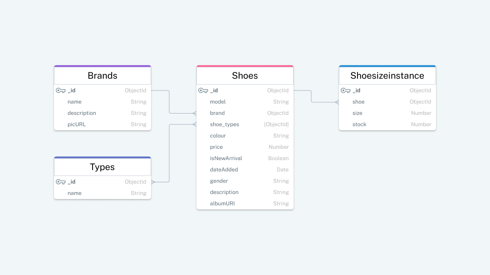

# Backend Express server for SCHU
The backend server for SCHU, an e-commerce site prototype. The server uses the Express framework to connect to a MongoDB database and exposes an API that returns the requested shoe collections, brands, shoe types, and shoes available.


## API

### Specific Shoe API

---

The Specific Shoe API returns a shoe data object with 2 properties: `shoe_model` and `shoe_sizes`. The former property provides the following data for each shoe found in the database:
- Shoe ObjectId
- Shoe model
- Shoe brand ObjectId and name
- Shoe type ObjectId and name
- Colour
- Price (in CAD)
- Whether its a new arrival
- Gender size
- Description
- Relative URI path for images

The `shoe_sizes` property is an unordered array of objects containing `size` and `stock` propertoes available for the returned shoe model.

```
https://example.com/api/collections/{brand}/{model}
```
#### Parameters

|   |   |   |
|---|---|---|
| `brand` | required | ObjectId of the brand, as generated by MongoDB. To retrieve a list of brand names and their respective ObjectIds, please use the Brands API (see below). |
| `model` | required | ObjectId of the specific shoe model, as generated by MongoDB. To retrieve a list of shoes and their respective ObjectIds, please use the Collections API (see below). |
&nbsp;

#### Example of API response

```
{
  "shoe_sizes": [
    {
      "size": 8,
      "stock": 16
    },
    ...
  ],
  "shoe_model": {
    "_id": "63feaf179734a327460fa671",
    "model": "Air Max '95 \"Anatomy of Air\"",
    "brand": {
        "_id": "63feaf369734a327460fa67f",
        "name": "Nike"
    },
    "shoe_types": [
        {
            "_id": "63feaf369734a327460fa67a",
            "name": "Sneakers"
        }
    ],
    "colour": "Team Red / Summit White-University Red",
    "price": 265,
    "isNewArrival": true,
    "gender": "men",
    "description": "A brand new colorway of the much beloved Air Max '95, done in a way to represent the human body and its layers of muscles, tissue and nerves under the skin.",
    "albumURI": "nike/menAirmax95anatomyofair"
    }
  }
}
```
&nbsp; 


### Collections API

---

The Collections API returns an array of shoe datapoints that meet the optional filter parameters. 

```
https://example.com/api/collections?brand={brand}&shoe_types={shoe_types}&new_arrivals={new_arrivals}&limit={limit}
```

#### Parameters

|   |   |   |
|---|---|---|
| `brand` | optional | ObjectId of the brand as generated by MongoDB. To retrieve a list of brand names and their respective ObjectIds, please use the Brands API (specified below).  |
| `shoe_types` | optional | ObjectId of the shoe type as generated by MongoDB. To retrieve a list of shoe types and their respective ObjectIds, please use the Shoe Types API (specified below). |
| `new_arrivals` | optional | By including this parameter, the returned shoes are limited to those with the property isNewArrical set to true. The value for the parameter can be anything. |
| `limit` | optional | The desired number of results to be included in the response. The number of returned shoes in the response will be the lower of available results and the value provided for this parameter. A value of 0 will be the same as not having a limit.  |
&nbsp;

#### Example of API response

```
[
  {
    "_id": "63feb0709734a327460fa694",
    "model": "Chuck 70 Hi x Barriers",
    "brand": {
        "_id": "63feb0709734a327460fa68e",
        "name": "Converse"
    },
    "shoe_types": [
        {
            "_id": "63feb0709734a327460fa691",
            "name": "Sneakers"
        }
    ],
    "colour": "Black / Fiery Red / Antique White",
    "price": 160,
    "isNewArrival": false,
    "gender": "men",
    "description": "This collaborative release draws inspiration from The North Star, a 19th-century anti-slavery newspaper founded by Frederick Douglass. The limited edition Chuck 70 is decorated with embroidered text, a custom star graphic, and co-branded details, uniting the narrative of two leading brands.",
    "albumURI": "converse/menChuck70hixbarriers"
  },
  ...
]
```
&nbsp; 


### Brands API

---

The Brands API returns an array of shoe brands currently in the database. The data provided for each brand is:
- Shoe brand ObjectId
- Brand name
- Description
- URL path for brand image

```
https://example.com/api/brands?limit={limit}
```
#### Parameters

|   |   |   |
|---|---|---|
| `limit` | optional | The desired number of results to be included in the response. The number of returned brands in the response will be the lower of available results and the value provided for this parameter. A value of 0 will be the same as not having a limit.  |
&nbsp;

#### Example API response

```
[
  {
    "_id": "63feb0c69734a327460fa695",
    "name": "Adidas",
    "description": "Adidas was started by Adolf Dassler in his mother's house in 1924. Dassler assisted in the development of spiked running shoes for athletic events, supplying U.S. sprinter Jesse Owens in the 1936 Summer Olympics. Since then, Adidas has established itself as an innovation powerhouse and a cultural staple, with products such as the Samba, Allround basketball and training shoe, Azteca Gold sprint spike, the iconic tracksuit, Telstar, Superstar, Adilette slide, StandSmith white tennis shoes and the Copa Mundial.",
    "picURL": "https://example.com/jordan/profile.jpg"
  },
  ...
]
```
&nbsp;

### Shoe Types API

---

The Shoe Types API returns an array of shoe types stored in the database. Each shoe type datapoint has the following information:
- Shoe type ObjectId
- Name

```
https://example.com/api/shoe_types
```


#### Example API response

```
[
  {
    "_id": "63feb2649734a327460fa6a0",
    "name": "Boots"
  },
  ...
]
```
&nbsp;

## Environment requirements
You need to install the required node packages from within the app directory

```
npm install
```

## Configuring
To configure the server, you need to:
- provide environmental variables
- populate the database


### Environment variables
Connecting your Express server to MongoDB requires a connection string for your database cluster. Your connection string will have the form:

```
mongodb+srv://[username:password@]host1[:port1][,...hostN[:portN]][/[defaultauthdb][?options]]
```
Save the string in the variable `DB_CONN` within a `.env` file in the project directory. The server is configured to use the `DB_CONN` environmental variable as your MongoDB connection string.


### Database population
The database is modelled on the following schema:



A script to populate the database with sample data is currently being worked on.
